# 🌍 Climate-Decision

**Smart Data Lakehouse Platform for Egyptian Climate Intelligence**

Climate-Decision is an end-to-end **ETLT (Extract, Transform, Load, Transform)** data platform built on a **Medallion Architecture (Bronze → Silver → Gold)**. It ingests Egyptian weather data, cleans and models it into an analytics-ready lakehouse, forecasts future climate trends with ML, and exposes everything through a **LangChain + NVIDIA NIM AI Agent** that answers natural-language questions and supports data-driven decisions.

---

## ✨ Key Features

- 🌦️ **Automated ingestion** of historical & current-year weather data for Egyptian governorates (Open-Meteo + Wikipedia revision history + scraped climate insights)
- 🥉🥈🥇 **Medallion Architecture** — Bronze (raw), Silver (cleaned/conformed), Gold (fact/dimension tables + ML-ready datasets)
- 📊 **Star-schema Gold layer** with `fact_weather` and supporting dimensions (`dim_date`, `dim_location`, `dim_condition`)
- 🤖 **ML forecasting module** producing 6-month-ahead weather predictions
- 🧠 **AI Agent (LangChain + NVIDIA NIM API)** for context-aware, natural-language querying over the lakehouse
- ☁️ **Azure SQL & local SQL support** via dedicated database scripts
- 🐳 **Dockerized** for easy deployment (`Dockerfile`, `compose.yaml`)
- ✅ **Test suite** covering ingestion fallback, cleaning, prediction, and app behavior

---

## 🏗️ Architecture

```
Raw Sources ──▶ Bronze (raw ingest) ──▶ Silver (cleaning) ──▶ Gold (facts/dims + ML-ready)
   │                                                                 │
   ├─ Open-Meteo API (governorate weather)                          ├─ ML Prediction (6-month forecast)
   ├─ Wikipedia revision history                                    └─ AI Agent (LangChain + NVIDIA NIM)
   └─ Scraped climate insights                                              │
                                                                      Natural-language
                                                                      decision support
```

---

## 🗄️ Data Model (ER Diagram)

```mermaid
erDiagram
    climate_insights ||--o{ stg_climate_insights : "loads into"
    wikipedia_revision_history ||--o{ stg_wikipedia_revision_history : "loads into"
    stg_climate_insights ||--o{ climate_insights_long : "unpivots into"
    stg_wikipedia_revision_history ||--o{ climate_insights_long : "enriches"
    climate_insights_long ||--o{ merged_weather : "feeds"
    merged_weather ||--o{ stg_governorates_weather : "feeds"
    merged_weather ||--o{ stg_egypt_weather_final : "feeds"

    climate_insights {
        varchar metric_name
        varchar jan
        varchar feb
        varchar mar
        varchar apr
        varchar may
        varchar jun
        varchar jul
        varchar aug
        varchar sep
        varchar oct
        varchar nov
        varchar dec
        varchar year_value
        varchar source
    }

    stg_climate_insights {
        varchar metric_name PK
        varchar jan
        varchar feb
        varchar mar
        varchar apr
        varchar may
        varchar jun
        varchar jul
        varchar aug
        varchar sep
        varchar oct
        varchar nov
        varchar dec
        varchar year_value
        varchar source
    }

    climate_insights_long {
        varchar metric_name PK
        int month_num PK
        varchar value
    }

    wikipedia_revision_history {
        datetime revision_timestamp
        varchar user
        text comment
        varchar source
    }

    stg_wikipedia_revision_history {
        datetime revision_timestamp PK
        varchar user
        text comment
        varchar source
    }

    merged_weather {
        varchar id PK
        varchar governorate
        date date PK
        int weather_code
        varchar condition
        numeric high_temp
        numeric max_temp
        numeric avg_max_temp
        numeric range_max_temp
        numeric std_max_temp
        numeric low_temp_c
        numeric min_temp
        numeric avg_min_temp
        numeric range_min_temp
        numeric std_min_temp
        numeric avg_humidity
    }

    stg_governorates_weather {
        varchar governorate PK
        varchar condition
        numeric high_temp_c
        numeric low_temp_c
        date weather_date PK
    }

    stg_egypt_weather_final {
        varchar governorate PK
        date weather_date PK
        int weather_code
        numeric max_temp
        numeric min_temp
        numeric avg_humidity
        varchar source
    }
```



> Bronze layer (`climate_insights`, `wikipedia_revision_history`) is cleaned into Silver staging tables, unpivoted into a long format, then merged and modeled into the Gold layer (`merged_weather` and its governorate-level views) used by the ML forecasting module and the AI Agent.

---

## 📁 Project Structure

```
Climate-Decision
├─ app.py                     # Flask/web app entry point
├─ main.py                    # Pipeline orchestration entry point
├─ compose.yaml / Dockerfile  # Containerized deployment
├─ data/
│  ├─ raw/                    # Raw ingested CSVs (historical + current year)
│  ├─ parsed/                 # Cleaned intermediate data (e.g. Wikipedia history)
│  ├─ lakehouse/gold/         # fact_weather.parquet, ml_ready.parquet
│  └─ predictions/            # 6-month weather forecast outputs
├─ lakehouse/
│  ├─ bronze/                 # Raw data access layer
│  ├─ silver/                 # Cleaning & conforming logic
│  └─ gold/                   # Fact table, ML feature prep, dimension builders (vis/)
├─ ml/
│  └─ prediction.py           # Forecasting model
├─ src/
│  ├─ ingestion/               # Weather + Wikipedia collectors, scraper, orchestrator
│  ├─ database/                # Azure/local DB uploaders & loaders
│  └─ transformation/          # Wikipedia data transformer
├─ templates/ & static/        # Frontend for the web app
├─ db_scripts/                 # Azure.sql / Locally.sql schema scripts
└─ tests/                      # Unit tests for ingestion, cleaning, prediction, app
```

---

## 🛠️ Tech Stack

| Layer | Technology |
|---|---|
| Ingestion | Python, Open-Meteo API, Web Scraping |
| Storage | Azure SQL, Parquet (Lakehouse) |
| Transformation | Pandas, custom ETLT pipelines |
| ML Forecasting | Scikit-learn |
| AI Agent | LangChain, NVIDIA NIM API |
| Web App | Flask, HTML/CSS/JS |
| Deployment | Docker, Docker Compose |
| Testing | Pytest |

---

## 🚀 Getting Started

### Prerequisites
- Python 3.10+
- Docker (optional, for containerized run)
- An Azure SQL instance or local SQL Server (see `db_scripts/`)
- An [NVIDIA API key](https://build.nvidia.com) for the AI Agent (NVIDIA NIM)

### 1. Clone the repository
```bash
git clone https://github.com/MY-DEPI-TEAM/Climate-Decision.git
cd Climate-Decision
```

### 2. Set up environment variables
```bash
cp .env.example .env
# Fill in your Azure SQL connection string, NVIDIA_API_KEY, etc.
```

### 3. Install dependencies
```bash
pip install -r requirements.txt
```

### 4. Run the ETLT pipeline
```bash
python main.py
```

### 5. Launch the web app
```bash
python app.py
```

### Or run everything with Docker
```bash
docker compose up --build
```

---

## 🧪 Running Tests
```bash
pytest tests/
```

---

## 🗺️ Roadmap

- [ ] Expand AI Agent tool coverage for deeper decision-support queries
- [ ] Add more governorates / data sources
- [ ] CI/CD pipeline for automated testing & deployment
- [ ] Interactive dashboard for Gold-layer exploration

---

## 👥 Team

Built by **MY-DEPI-TEAM** as a graduation project — combining data engineering, ML, and AI agent design into a unified climate decision-support platform.

---

## License & Copyright

© 2026 George Essam. Licensed under the [Apache License 2.0](LICENSE).
